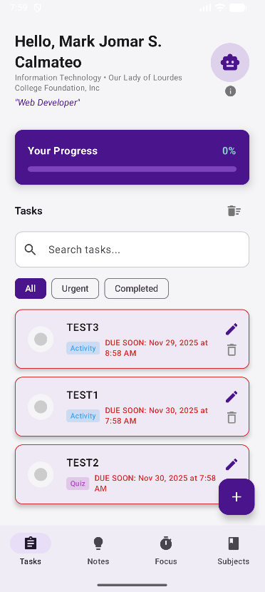
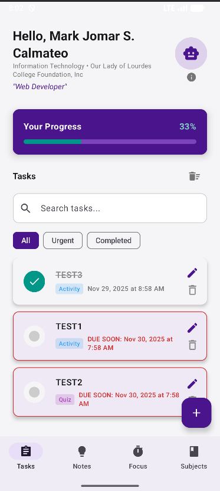
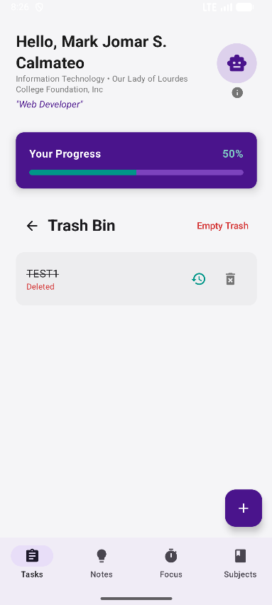
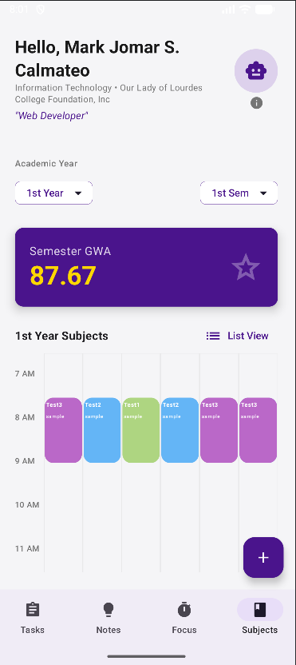
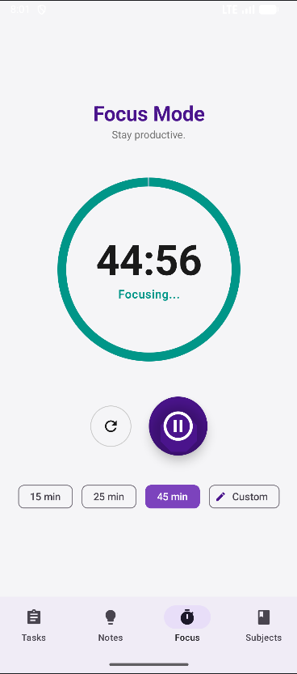

# 🎓 Student Manager App

A comprehensive Android productivity application designed specifically for students to manage tasks, track academic performance, and stay focused. Built with **Modern Android Development** standards using Kotlin, Jetpack Compose, and Room Database.

## ✨ New Features (v3.0)

### 🌙 Dark Mode Support
* **Theme Toggle:** Instantly switch between Light and Dark modes with a dedicated button.
* **Adaptive UI:** Colors and text automatically adjust for optimal readability in any lighting.

### 🔔 Smart Notifications
* **Class Reminders:** Get notified **15 minutes before** every class starts.
* **Task Deadlines:** Automatic alerts for assignments due today.

### 🗑️ Trash Bin & Safety
* **Soft Delete:** Accidental deletions are safe! Tasks and Subjects go to the Trash Bin first.
* **Restore:** Bring back deleted items with a single tap.
* **Empty Trash:** Secure confirmation dialog prevents permanent data loss.

## 🚀 Core Features

### 📅 Task Management
* **Customization:** Color-code tasks (Sticky Note style) and use **Bold** or **Large** text for important items.
* **Search & Filter:** Instantly find tasks or filter by "Urgent" and "Completed".

### 📚 Academic Tracker
* **Subject Enrollment:** Add subjects with specific schedules (Days, Start/End Time).
* **Schedule Visualizer:** View your class schedule in a dynamic **Grid View** or standard List View.
* **GWA Calculator:** Automatically calculates your Semester General Weighted Average.

### 🧠 Productivity
* **Focus Mode:** A built-in Pomodoro-style timer with custom durations.
* **Brain Dump:** Quick, colorful sticky notes for capturing ideas on the fly.

## 📸 Screenshots

|              Dashboard              | Trash Bin | Schedule Grid | Focus Timer |
|:-----------------------------------:|:---:|:---:|:---:|
|  |  |  |  |

*> Note: Don't forget to update your screenshots folder with new images showing Dark Mode!*

## 🛠️ Tech Stack

* **Language:** [Kotlin](https://kotlinlang.org/) (100%)
* **UI Framework:** [Jetpack Compose](https://developer.android.com/jetpack/compose) (Material3 Design)
* **Architecture:** MVVM (Model-View-ViewModel)
* **Local Database:** [Room Database](https://developer.android.com/training/data-storage/room)
* **Async Operations:** Coroutines & Kotlin Flow
* **Image Loading:** [Coil](https://coil-kt.github.io/coil/)
* **Notifications:** Android AlarmManager & BroadcastReceiver

## 👨‍💻 Developer

**Mark Jomar S. Calmateo**
* [GitHub](https://github.com/Jom-kowd)
* [LinkedIn](https://www.linkedin.com/in/mark-jomar-calmateo-684834366/)

---

*Built with ❤️ for students everywhere.*